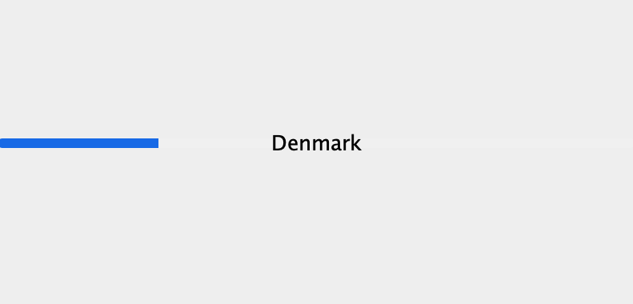
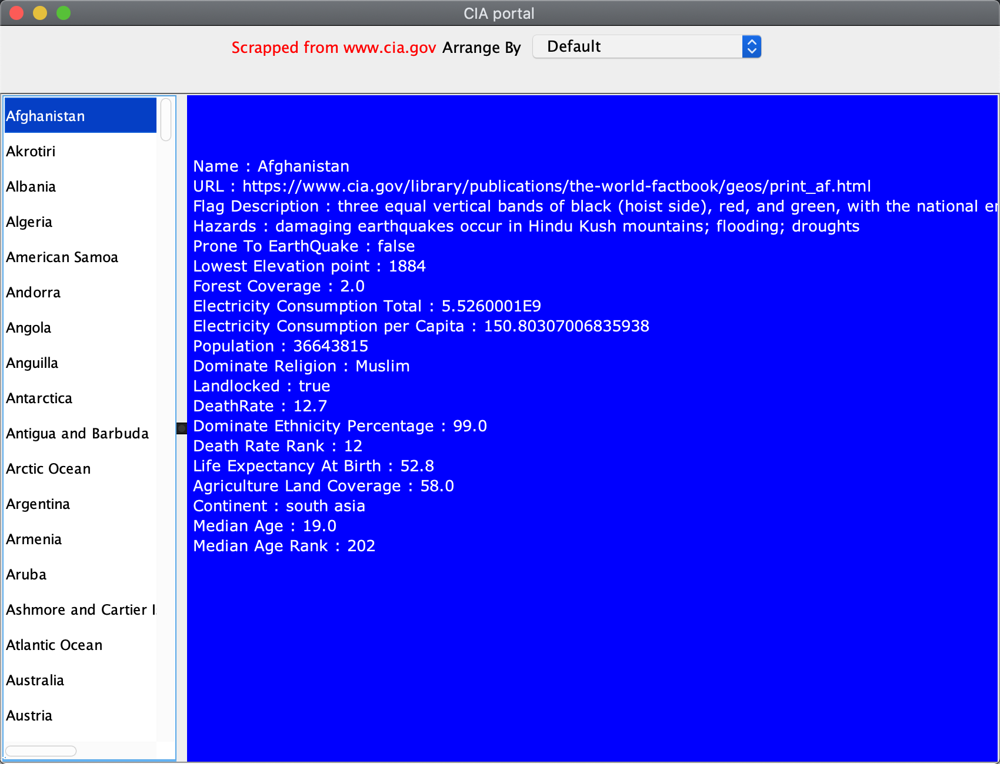

# CIA-country-data-crawler

## Build dependencies :

- JSoup [Download](https://jsoup.org/packages/jsoup-1.13.1.jar)

## Runtime dependencies

- good internet connection (for the crawler)

### Steps to run project :

1. Download Project and save in files.
2. Open with Intelli-j idea
3. Download dependencies
4. goto File -> Project Structure -> Libraries -> click (+) to add dependency
5. Apply and run Application.main()

### Possible Issue
##### No Run Icon on Application.main() 
   - Right-click a folder in the Project tool window.
   - Select Mark Directory as from the context menu.
   - Select the Sources root
   - File -> Project Structure -> project & **Make sure that _Compiler output path_ is set**

## DEMO

- #### loading
  
- #### App
  
